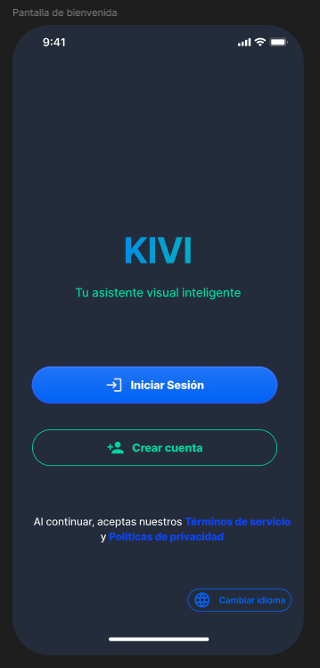
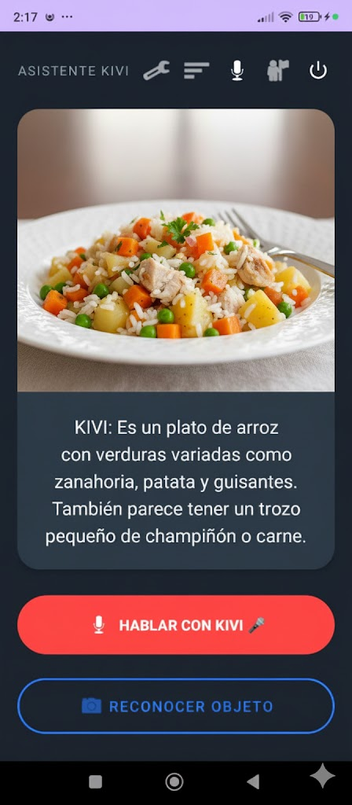

# KiviApp

KiviApp es una aplicación Android diseñada para ofrecer asistencia visual inteligente a personas con discapacidad visual parcial, baja visión o dificultades para interpretar información visual. Utiliza la API de inteligencia artificial Gemini de Google para analizar imágenes del entorno y proporcionar retroalimentación auditiva en tiempo real, ayudando a los usuarios a moverse con mayor autonomía y seguridad.

## ✨ Características

- **Asistencia Visual por Voz:** Permite al usuario interactuar con la aplicación mediante comandos de voz y recibir respuestas auditivas.
- **Reconocimiento de Objetos y Texto:** Captura imágenes con la cámara del dispositivo y utiliza IA para identificar objetos, colores, rostros y texto en el entorno.
- **Navegación Asistida:** Detecta obstáculos en tiempo real y alerta al usuario mediante señales auditivas y hápticas.
- **Interacción con IA:** Conversación natural con el asistente Kivi para obtener descripciones del entorno, ayuda contextual y más.
- **Autenticación de Usuarios:** Inicio de sesión seguro mediante Firebase Authentication (correo/contraseña y Google Sign-In).
- **Almacenamiento de Datos:** Guarda configuraciones de accesibilidad y preferencias del usuario en Cloud Firestore.
- **Gestión de Archivos:** Almacena imágenes capturadas y otros archivos en Firebase Storage.
- **Reproducción de Media:** Visualiza contenido multimedia directamente en la aplicación.

## 🚀 Tecnologías Utilizadas

| Tecnología                  | Propósito                                                                 |
|----------------------------|---------------------------------------------------------------------------|
| Kotlin                     | Lenguaje de programación principal.                                      |
| Google Generative AI       | Para las funciones de inteligencia artificial (API de Gemini).           |
| Firebase Platform          | Backend como servicio (BaaS).                                            |
| ↳ Firebase Authentication  | Autenticación de usuarios.                                               |
| ↳ Cloud Firestore          | Base de datos NoSQL en tiempo real.                                      |
| ↳ Firebase Storage         | Almacenamiento de archivos en la nube.                                   |
| Android Jetpack            | Conjunto de librerías para el desarrollo de apps modernas.               |
| ↳ View Binding             | Vinculación de vistas de forma segura.                                   |
| ↳ AppCompat, Material3     | Componentes de UI y diseño.                                              |
| ↳ Media3 ExoPlayer         | Reproducción de contenido multimedia.                                    |
| Google Play Services       | Para la integración con Google Sign-In.                                  |

---

## 🤖 API de Inteligencia Artificial (Gemini)

Uno de los pilares de KiviApp es su integración con la **API de IA Generativa de Google (Gemini)**. Esta característica permite a los usuarios obtener descripciones detalladas del entorno capturado por la cámara, lo cual es fundamental para personas con discapacidad visual.

### ¿Cómo funciona?

La aplicación captura una imagen, la envía a la API de Gemini junto con un prompt contextual, y el modelo devuelve una descripción en lenguaje natural. Esta respuesta es convertida a voz y transmitida al usuario mediante el motor Text-to-Speech de Android.

### Capacidades

- **Descripción de Escenas:** Identifica objetos, personas, colores y textos en la imagen.
- **Alertas de Seguridad:** Detecta posibles riesgos como obstáculos, escalones o objetos a la altura de la cabeza.
- **Conversación Contextual:** Permite al usuario hacer preguntas sobre lo que ve la cámara y recibir respuestas claras y útiles.

---

## 🔧 Guía de Instalación (Getting Started)

Para poder compilar y ejecutar este proyecto, es **indispensable** seguir los siguientes pasos en orden.

### **Paso 1: Clona el Repositorio**

```bash
git clone https://github.com/FernandoHQ1001/KiviApp.git
cd KiviApp
git checkout rami1-version_v3
```

### **Paso 2: Prerrequisito Esencial - Crear tu API Key de Gemini**

Antes de cualquier otra cosa, necesitas obtener una clave de API para el servicio de IA Generativa de Google. Sin esta clave, la funcionalidad principal de la aplicación no operará.

1.  **Ve a Google AI Studio:** Navega a [**Google AI Studio**](https://aistudio.google.com/app/apikey).
2.  **Crea tu API Key:** Haz clic en `"Create API key in new project"`.
3.  **Copia la clave:** Guarda esta clave en un lugar seguro. La necesitarás en el siguiente paso.

### **Paso 3: Configura tus Claves de API de Forma Segura**

Para mantener tu clave de API segura y fuera del control de versiones, la añadirás en el archivo `local.properties`.

1.  Busca el archivo `local.properties` en la raíz de tu proyecto. Si no existe, créalo.
2.  Añade la siguiente línea, reemplazando `"TU_API_KEY_AQUI"` con la clave que copiaste:
    ```properties
    GEMINI_API_KEY="TU_API_KEY_AQUI"
    ```

### **Paso 4: Configura el Proyecto de Firebase**

La aplicación utiliza Firebase para la autenticación y la base de datos.

1.  **Ve a la Consola de Firebase:** Navega a [https://console.firebase.google.com/](https://console.firebase.google.com/).
2.  **Crea un proyecto nuevo** o selecciona uno existente.
3.  **Añade una aplicación Android:**
    *   Usa el `applicationId`: `com.example.kiviapp`.
    *   Sigue los pasos indicados y descarga el archivo `google-services.json`.
4.  **Mueve el archivo `google-services.json`** al directorio `app/` de tu proyecto en Android Studio.
5.  **Habilita los servicios necesarios** en la consola de Firebase:
    *   **Authentication:** Activa los proveedores de **"Correo electrónico/Contraseña"** y **"Google"**.
    *   **Firestore Database:** Crea una nueva base de datos (puedes empezar en modo de prueba).
    *   **Storage:** Configura un bucket de almacenamiento para tus archivos.

### **Paso 5: Compila y Ejecuta**

1.  Abre el proyecto en Android Studio.
2.  Espera a que la sincronización de Gradle finalice.
3.  Ejecuta la aplicación en un emulador o en un dispositivo físico.

---

## 👨‍💻 Equipo de Desarrollo

Este proyecto fue desarrollado para la asignatura **Desarrollo de sistemas móviles**.

**Docente:**
- Gelber Uscuchagua Flores

**Grupo:** G1 - Los 404

**Integrantes:**
- Arce Crisanto, Alexander Jeferson
- Bazalar Cruz, Carlos Alonso
- Huamani Quispe, Jose Fernando
- Ttito Carhuas, Carolhay
- Villanueva Romero, Jheramy Danlevy

---

## 📸 Screenshots

| Pantalla de Inicio | Chat con IA | Perfil de Usuario |
| :---: | :---: | :---: |
|  |  |  |


## 📄 Licencia

Este proyecto está bajo la Licencia MIT. Consulta el archivo `LICENSE` para más detalles.
